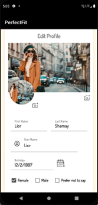
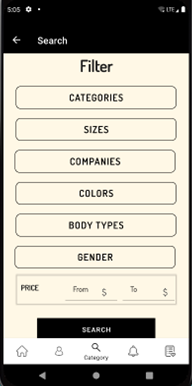
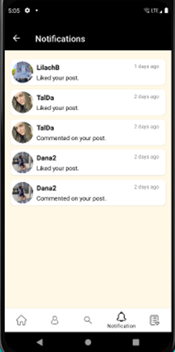

# PerfectFit - Android Application 

<br />
<p align="center">
    <a href="https://github.com/kelysot/PerfectFitApp-Android">
      
  </a>
 </p>
 
 <p align="center">
	This is the final project of our degree in Computer Science (B.Sc) that was supervised by Mr. Haim Shafir.</br>
  The project contains a client side - an android app written in Java and a server side written in Node.js with a connection to the database - MongoDB.</br>
The app is designed to improve the online clothing shopping experience.</br>
The app will display posts that contain clothes that are suitable for the user's body shape and proportions. </br></br>
Thanks ❤</br></br>
</p>

## App Functionality:

1. Implementation of Users Identification and Users Registration:
	- Each user can create up to 5 different profiles in his account.
	- Authentication and validation inputs of the users when entering the app.
	- Future logins to the app after registeration will login the user automatically.
2. Profile creation and editing - The user need to enter the profile information:
	- Basic details: first name, last name, gender, username, date of birth (age), photos.
	- User sizes: shoulder, chest, waist, hips, shoes size, height, weight and body structure.
3. Home page - The profile owner can scroll and see the posts that suited to him (adjusted using Pearson algorithm).
4. Upload and edit a post - The profile owner can upload a post about one item of clothing, and share where he bought it, describe it (in terms of color, size, price, general description, etc.).
5. Filter posts: The profile owner can filter posts according to his wishes. He can choose which filters he wants (such as brand, color, categories, etc.).
6. Categories and sub-categories - The profile owner can search for posts according to categories and sub-categories from the general database of posts.
7. Wishlist - The profile owner can add posts to the wishlist using a dedicated button in each post.
8. Notifications - The profile owner will get notifications when others like or comment on his post or when they start to follow him.
9. Likes and comments - The profile owner can like and comment on posts in the app.
10. Delete post - The profile owner can delete his posts.
11. Delete profile - The profile owner can delete his profile.


## Getting Started...

#### Installation
- Export git repository to Android Studio
```bash
https://github.com/kelysot/PerfectFitApp-Android.git
```
- Build and run the application on an Android emulator


<!-- ## Screenshots

Intro Page | Login Page |  Signup Page
:-------------------------:|:-------------------------:|:-------------------------:
  |   |  

Create + Edit Profile Step 1 Page | Create + Edit Profile Step 2 Page |  Create + Edit Profile Step 3 Page 
:-------------------------:|:-------------------------:|:-------------------------:
  |   |  

Home Page |  Profile Page |  User - Profiles Page
:-------------------------:|:-------------------------: |:-------------------------:
  |   |  

Add + Edit Post 1 Page |  Add + Edit Post 2 Page |  Post 1 Page 
:-------------------------:|:-------------------------: |:-------------------------:
  |   |  

Post 2 Page |  Category Page |  SubCategory Page
:-------------------------:|:-------------------------: |:-------------------------:
  |   |  

Search Page |  Search feature Page |  Wishlist Page
:-------------------------:|:-------------------------: |:-------------------------:
  |   |  

Notifications Page |  Likes Page |  Comments Page
:-------------------------:|:-------------------------: |:-------------------------:
  |   |  


 -->
